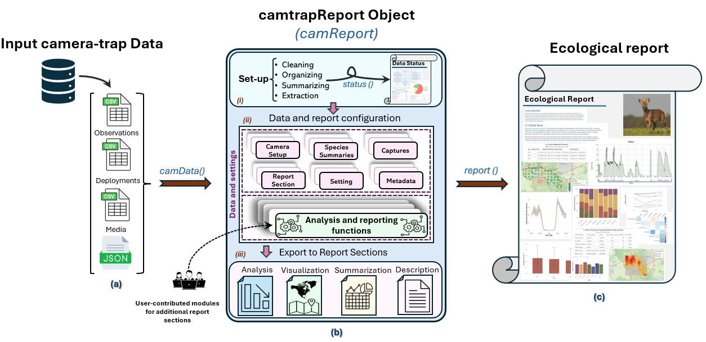

---
output:
  github_document:
    html_preview: false
---

<!-- README.md is generated from README.Rmd. Edit README.Rmd, not README.md. -->

```{r readme-setup, include=FALSE}
knitr::opts_chunk$set(
  collapse = TRUE,
  comment = "#>",
  fig.path = "man/figures/README-",
  out.width = "100%"
)

options(width = 80)
```

<h1 align="center">camtrapReport</h1>

<p align="center">
  <em>Reproducible reporting for camera-trap monitoring data</em>
</p>

<p align="center">
  <a href="https://github.com/spatialecology/camtrapReport/actions/workflows/R-CMD-check.yaml"></a>
  <a href="https://github.com/spatialecology/camtrapReport/actions/workflows/pkgcheck.yaml"></a>
  <a href="https://app.codecov.io/github/spatialecology/camtrapReport"></a>
  <a href="https://www.repostatus.org/#active"></a>
  <a href="https://www.r-project.org/"></a>
  <a href="https://github.com/spatialecology/camtrapReport/blob/main/LICENSE.md"></a>
</p>

`camtrapReport` converts camera-trap data in
[Camtrap DP](https://camtrap-dp.tdwg.org/) format into two configurable HTML
outputs:

- a **Data Status Check** for data completeness, consistency, annotation, and
  spatiotemporal coverage; and
- an **Ecological Report** containing selected summaries, analyses, figures,
  maps, tables, metadata, and explanatory text.



## Installation

Install the development version from GitHub:

```{r installation, eval=FALSE}
if (!requireNamespace("pak", quietly = TRUE)) {
  install.packages("pak")
}

pak::pkg_install("spatialecology/camtrapReport")
```

Optional dependencies required by report modules can be installed with
`camtrapReport::install_all()`.

## Quick start

The example below uses a compact subset of the
[GMU8_LEUVEN dataset](https://doi.org/10.15468/4u3wm4). The data are copied to
a temporary directory because `camData()` may write processed files alongside
the input data. The subset is intended for demonstration and testing, not
ecological inference; its preparation is
[documented here](https://github.com/spatialecology/camtrapReport/blob/main/inst/external/README-Leuven-dataset.md).

```{r quick-start}
library(camtrapReport)

source_dir <- system.file(
  "external",
  package = "camtrapReport",
  mustWork = TRUE
)

example_root <- tempfile("camtrapReport-example-")
dir.create(example_root)

stopifnot(file.copy(
  file.path(source_dir, "dataset"),
  example_root,
  recursive = TRUE,
  copy.mode = FALSE
))

cm <- camData(
  data = file.path(example_root, "dataset"),
  habitat = read.csv(file.path(source_dir, "habitat", "habitat.csv")),
  study_area = file.path(source_dir, "study_area", "study_area.shp"),
  update = TRUE
)

cm
```

A Camtrap DP ZIP archive or extracted directory is the only required input.
Habitat data and a study-area boundary are optional.

Generate the two reports:

```{r generate-reports, message=FALSE, warning=FALSE, results='hide'}
status_file <- status(
  cm,
  filename = file.path(example_root, "status.html"),
  view = FALSE
)

report_file <- report(
  cm,
  filename = file.path(example_root, "ecological-report.html"),
  view = FALSE
)
```

Inspect metadata and select report sections:

```{r configure-report, message=FALSE, warning=FALSE}
info(cm, name = c("title", "authors"))

selected_sections <- section_names(
  keep = c("introduction", "methods", "study_area", "sampling", "effort")
)

sections(cm, selected_sections)
```

Use `gui(cm)` to configure and generate reports interactively.

## Scope and interpretation

`camtrapReport` supports reporting rather than general camera-trap data
management or specialised ecological modelling. It complements
[`camtrapdp`](https://inbo.github.io/camtrapdp/),
[`camtraptor`](https://inbo.github.io/camtraptor/),
[`camtrapR`](https://jniedballa.github.io/camtrapR/), and
[`ct`](https://cran.r-project.org/package=ct).

The package has been evaluated with real camera-trap datasets and by
independent users, but it has not yet been applied in a published ecological
study. A successful Data Status Check confirms completion of the implemented
checks; it does not establish that the survey design or data are suitable for
a particular analysis. Reports should be reviewed before sharing because maps
and derived results may reveal sensitive species locations.

## Documentation and support

- [Package overview](https://spatialecology.github.io/camtrapReport/articles/Package-Overview.html)
- [Data Status Check](https://spatialecology.github.io/camtrapReport/articles/data-status-report.html)
- [Ecological Report](https://spatialecology.github.io/camtrapReport/articles/ecological-report.html)
- [Function reference](https://spatialecology.github.io/camtrapReport/reference/index.html)
- [Issue tracker](https://github.com/spatialecology/camtrapReport/issues)

## Citation

```{r citation}
citation("camtrapReport")
```

## Contributing

Contributions are welcome. Please read the
[contributing guidelines](https://github.com/spatialecology/camtrapReport/blob/main/.github/CONTRIBUTING.md)
and
[Code of Conduct](https://github.com/spatialecology/camtrapReport/blob/main/.github/CODE_OF_CONDUCT.md).

```{r validate-and-clean, include=FALSE}
stopifnot(
  file.exists(status_file),
  file.exists(report_file)
)

unlink(example_root, recursive = TRUE, force = TRUE)
```
