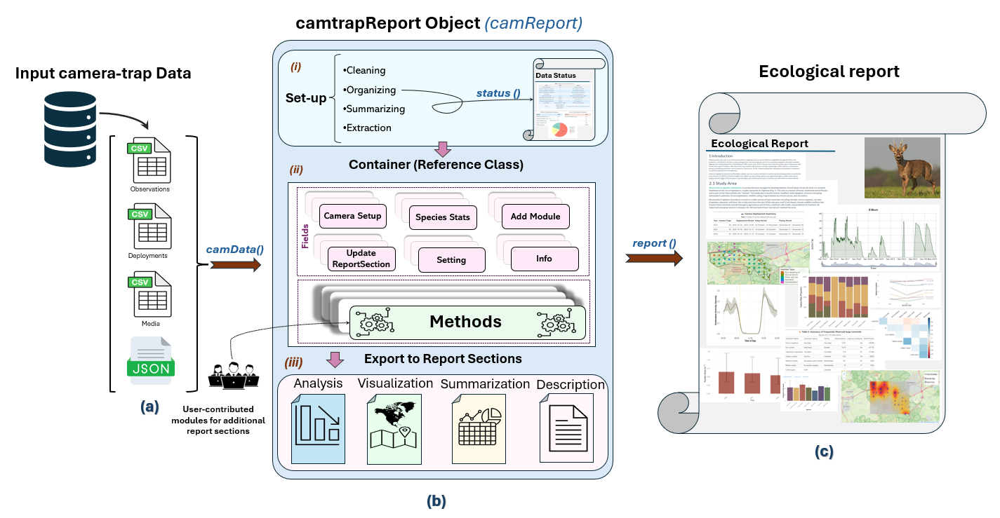

<p align="center">
  
</p>

<h1 align="center">camtrapReport</h1>

<p align="center">
  <em>A modular R package for automating camera-trap data reporting in wildlife monitoring.</em>
</p>

<p align="center">
  <a href="https://www.r-project.org/"></a>
  <a href="https://github.com/spatialecology/camtrapReport/blob/main/LICENSE.md"></a>
  <a href="https://doi.org/10.5281/zenodo.18405441"></a>
  <a href="https://spatialecology.github.io/camtrapReport/"></a>
</p>

---

`camtrapReport` turns standardised camera-trap datasets into structured, reproducible ecological reports. Drop in a [Camtrap-DP](https://camtrap-dp.tdwg.org/) `.zip`, and the package will diagnose data quality, run a suite of ecological analyses, and compile narrative, figures, maps and tables into a single article-style HTML document.

<p align="center">
  
  <br>
  <em>Schematic overview of the camtrapReport workflow.</em>
</p>

## Install

```r
remotes::install_github("spatialecology/camtrapReport")
library(camtrapReport)
install_All()   # Install all package dependencies required for full functionality
```

## Create the camReport object

The only required input is a single `.zip` file containing the dataset in Camtrap-DP format.

```r
cm <- camData("Leuven-data.zip")   # build the camReport object
```

## Optional input

Optional input data can be used to improve maps, add spatial context, and support richer summaries and analyses. The two supported optional inputs are **habitat data** and a **study area polygon**.

Habitat information can be provided as a two-column CSV file containing `locationName` and `Habitat`. An example `habitat.csv` template can be downloaded [here](https://drive.google.com/file/d/1lo_CwpLQmuxOVB5193tIAsEq7WF9v0t-/view?usp=sharing). A polygon shapefile representing the study area boundary can also be provided. When available, these optional inputs can be passed directly to `camData()`.

```r
habitat <- read.csv("C:/Users/Data/habitat.csv")

head(habitat) # check if the data.frame follows the required structure:
#   locationName      Habitat
# 1       VEL-01     Sandhill
# 2       VEL-02       Forest
# 3       VEL-03 Dry_heathland

# Spatial polygon of the study area:
bnd <- vect("C:/Users/Data/polygon.shp")

# Read the camera-trap data together with habitat data and the study area boundary:
cm <- camData(
  data = "C:/Users/Data/Leuven-data.zip",
  habitat = habitat,
  study_area = bnd
)

cm # shows brief information about the camReport object
```

Once the `camReport` object is built, two reports can be generated: the **Data Status Check** and the **Ecological Insight Report**.

## Data status report

To generate a Data Status Report and review the quality and completeness of the input data, use `status()`:

```r
status(cm, view = TRUE)  # With view = TRUE, the generated report opens automatically
```

## Ecological report

Once the input data have been prepared, a full ecological report can be generated using the `report()` function:

```r
report(cm, view = TRUE)  # Opens the report automatically after creation
```

> **Tip:** Reports are saved in your current working directory.

## Customising the report

The contents of the `camReport` object are extracted or inferred from the main dataset. These metadata can be viewed and modified using the `info()` function:

```r
info(cm)  # Shows metadata for available fields

# You can also retrieve information for specific fields:
info(cm, name = c("title", "subtitle"))
info(cm, name = "authors")

# You can override the information:
info(cm, name = "authors") <- c("Elham Ebrahimi", "Patrick Jansen")

# View the updated metadata:
info(cm)
```

## Adjusting the focus group

The Ecological Report can be generated for a selected taxonomic group, referred to as the `focus_group`. By default, this is set to `"large_mammals"`.

Several predefined groups are already included in the package, such as `"large_mammals"`, `"wild_animals"`, `"birds"`, `"amphibians"`, `"domestic"`, and `"human_observation"`.

Users can also define a new group by assigning records based on one or more of the following fields:

- `scientificName`
- `class`
- `order`
- `observationType`

```r
# Check which group is currently set as the focus group
cm$setting$focus_groups

# Check which groups are available
names(cm$group_definition)

# Change the focus group
cm$set_focus_group(x = "wild_animals")

# Check the rule used to define specific groups
cm$get_group("large_mammals")
cm$get_group("wild_mammals")

# Add a new group or modify an existing group definition
cm$add_group(
  name = "wild_animals",
  x = list(
    scientificName = c(
      "Mustela putorius",
      "Myodes glareolus",
      "Procyon lotor"
    )
  )
)

cm$setup()
```

## Selecting years and adjusting filters

The report can be generated for all years in the dataset or for a selected time period.

```r
# Check which years are covered by the records
cm$extractYears()

# Select a specific time window for report generation
cm$years <- 2023:2024

cm$setup()
```

The count filter defines the minimum number of observations required for a species to be included in the report.

```r
# Check the current count filter
cm$filterCount

# The default value is usually 25

# Modify the count filter
cm$filterCount <- 10
```

## Viewing and updating report sections

`camtrapReport` is a modular and extensible package, which means each report is built from independent sections.

You can inspect the available sections before editing the report. This helps you identify the exact section names that can be modified, updated, kept, or excluded.

The function `updateReportSection()` can be used to edit the content of an existing report section. For example, if the text in the introduction section needs to be changed, it can be updated as shown below.

```r
# View available report sections
listReportSections(cm)
sections(cm)
section_names(cm)

# Update the text of a specific report section
updateReportSection(
  cm,
  section = "introduction",
  text = "This is new text to replace the existing section content.",
  append_text = FALSE
)

# If append_text = TRUE, the new text is added to the existing text.
# If append_text = FALSE, the existing text is replaced.

# Check the report sections again after making changes
listReportSections(cm)
```

## Selecting which sections to include

Before generating the report, you can check which sections will be included.

If you want to exclude or keep certain sections, you can use the `sections()` function. In `sections()`, you specify the names of the sections that should be included in the report.

To make it easier to access section names, use the `section_names()` function.

```r
# Check what sections will be included in the report
listReportSections(cm)

# Show the names of all existing sections in the package
section_names()

# Exclude one section
section_names(exclude = "introduction")

# Exclude more than one section
section_names(exclude = c("acknowledgements", "appendix"))

# Keep only selected sections
section_names(
  keep = c("introduction", "methods", "study_area")
)

# Example:
# Include all sections except "richness" and "co_occurrence"
n <- section_names(
  exclude = c("richness", "co_occurrence")
)

# Check the names of the sections that will be used
n

# Update the sections in the cm object
sections(cm, n)

# Generate the report with the selected sections
report(cm, view = TRUE)

# Restore all available sections
sections(cm, n = section_names())
```

## Graphical user interface

A graphical user interface is available for exploring outputs, adjusting settings and generating reports interactively.

```r
gui(cm)
```

## Privacy-aware by design

Reports can be shared even when raw images or precise locations cannot — broadening the range of monitoring programmes that can contribute results to research, management and policy.

## Example data

Try the workflow using the open [Leuven Camtrap-DP dataset](https://drive.google.com/file/d/1l-nSJKopM9agJgtTCzTx3tQiP8aTYH5c/view?usp=sharing). This example includes camera-trap data files based on the original Camtrap-DP dataset, which is available from [GBIF](https://doi.org/10.15468/4u3wm4), together with optional supporting files such as `habitat.csv` and a study-area boundary shapefile.

This is a relatively large dataset, covering multiple years and more than 300 camera locations, so preprocessing and report generation may take some time.

## Learn more

[Package overview](https://spatialecology.github.io/camtrapReport/articles/Package-Overview.html) · [Data Status Report](https://spatialecology.github.io/camtrapReport/articles/data-status-report.html) · [Ecological Report](https://spatialecology.github.io/camtrapReport/articles/ecological-report.html) · [Module management](https://spatialecology.github.io/camtrapReport/articles/modules.html)

## Contribute

Open an [issue](https://github.com/spatialecology/camtrapReport/issues), start a [discussion](https://github.com/spatialecology/camtrapReport/discussions), or contribute a module. All welcome.
