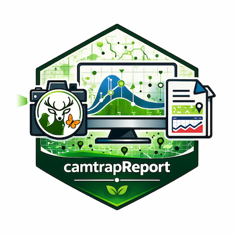
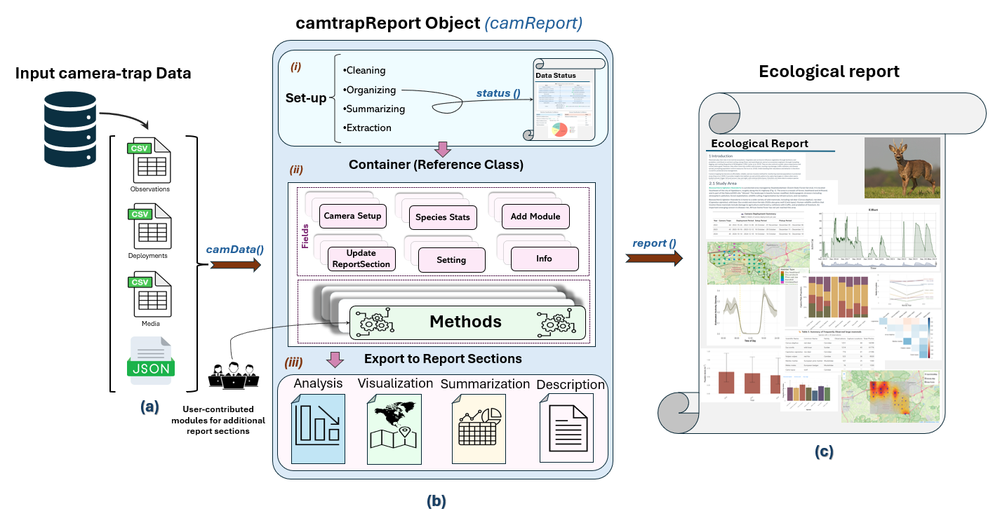

<p align="center">
  
</p>

<h1 align="center">camtrapReport</h1>

<p align="center">
  <em>A modular R package for automating camera-trap data reporting in wildlife monitoring.</em>
</p>

<p align="center">
  <a href="https://github.com/spatialecology/camtrapReport/actions/workflows/R-CMD-check.yaml"></a>
  <a href="https://github.com/spatialecology/camtrapReport/actions/workflows/pkgcheck.yaml"></a>
  <a href="https://app.codecov.io/github/spatialecology/camtrapReport"></a>
  <a href="https://www.repostatus.org/#active"></a>
  <a href="https://www.r-project.org/"></a>
  <a href="https://github.com/spatialecology/camtrapReport/blob/main/LICENSE.md"></a>
  <a href="https://spatialecology.github.io/camtrapReport/"></a>
</p>

---

`camtrapReport` turns standardised camera-trap datasets into structured, reproducible ecological reports through an automated workflow. Drop in a [Camtrap DP](https://camtrap-dp.tdwg.org/) ZIP file, and the package will diagnose data quality, run a suite of ecological analyses, and compile narrative text, figures, maps, and tables into a single article-style HTML document.

<p align="center">
  
  <br>
  <em>Schematic overview of the automated <code>camtrapReport</code> workflow.</em>
</p>


## Install

```r
remotes::install_github("spatialecology/camtrapReport")
library(camtrapReport)
install_All()   # Install all package dependencies required for full functionality
```

## Create the camReport object

The only required input is a single `.zip` file containing the dataset in Camtrap DP format.

```r
cm <- camData("Leuven-data.zip")   # build the camReport object
```

## Optional input

Optional inputs can be supplied directly to `camData()`, including habitat data as a CSV file ([see template](https://drive.google.com/file/d/1lo_CwpLQmuxOVB5193tIAsEq7WF9v0t-/view?usp=sharing)) and the study-area boundary as a polygon shapefile.

```r
habitat <- read.csv("C:/Users/Data/habitat.csv")

head(habitat) # check if the data.frame follows the required structure:
#   locationName      Habitat
# 1       VEL-01     Sandhill
# 2       VEL-02       Forest
# 3       VEL-03 Dry_heathland

# Spatial polygon of the study area:
bnd <- vect("C:/Users/Data/polygon.shp")

# Read the camera-trap data together with habitat data and the study area boundary:
cm <- camData(
  data = "C:/Users/Data/Leuven-data.zip",
  habitat = habitat,
  study_area = bnd
)

cm # shows brief information about the camReport object
```

Once the `camReport` object is built, two reports can be generated: the **Data Status Check** and the **Ecological Insight Report**.

## Data status report

To generate a Data Status Report and review the quality and completeness of the input data, use `status()`:

```r
status(cm, view = TRUE)  # With view = TRUE, the generated report opens automatically
```

## Ecological report

Once the input data have been prepared, a full ecological report can be generated using the `report()` function:

```r
report(cm, view = TRUE)  # Opens the report automatically after creation
```

## Customising the report

The contents of the `camReport` object are extracted or inferred from the main dataset. These metadata can be viewed and modified using the `info()` function:

```r
info(cm)  # Shows metadata for available fields

# You can also retrieve information for specific fields:
info(cm, name = c("title", "subtitle"))
info(cm, name = "authors")

# You can override the information:
info(cm, name = "authors") <- c("Elham Ebrahimi", "Patrick Jansen")

# View the updated metadata:
info(cm)
```

## Adjusting the focus group

The Ecological Report can be generated for a selected taxonomic group, referred to as the `focus_group`. By default, this is set to `"large_mammals"`.

Several predefined groups are already included in the package, such as `"large_mammals"`, `"wild_animals"`, `"birds"`, `"amphibians"`, `"domestic"`, and `"human_observation"`.

Users can also define a new group by assigning records based on one or more of the following fields:

- `scientificName`
- `class`
- `order`
- `observationType`

```r
# Check which group is currently set as the focus group
cm$setting$focus_groups

# Check which groups are available
names(cm$group_definition)

# Change the focus group
cm$set_focus_group(x = "wild_animals")

# Check the rule used to define specific groups
cm$get_group("large_mammals")
cm$get_group("wild_mammals")

# Add a new group or modify an existing group definition
cm$add_group(
  name = "wild_animals",
  x = list(
    scientificName = c(
      "Mustela putorius",
      "Myodes glareolus",
      "Procyon lotor"
    )
  )
)

cm$setup()
```

## Selecting years and adjusting filters

The report can be generated for all years in the dataset or for a selected time period.

```r
# Check which years are covered by the records
cm$extractYears()

# Select a specific time window for report generation
cm$years <- 2023:2024

cm$setup()
```

The count filter defines the minimum number of observations required for a species to be included in the report.

```r
# Check the current count filter
cm$filterCount

# The default value is usually 25

# Modify the count filter
cm$filterCount <- 10
```

## Viewing and updating report sections

`camtrapReport` is a modular and extensible package, which means each report is built from independent sections.

You can inspect the available sections before editing the report. This helps you identify the exact section names that can be modified, updated, kept, or excluded.

The function `updateReportSection()` can be used to edit the content of an existing report section. For example, if the text in the introduction section needs to be changed, it can be updated as shown below.

```r
# View available report sections
listReportSections(cm)
sections(cm)
section_names(cm)

# Update the text of a specific report section
updateReportSection(
  cm,
  section = "introduction",
  text = "This is new text to replace the existing section content.",
  append_text = FALSE
)

# If append_text = TRUE, the new text is added to the existing text.
# If append_text = FALSE, the existing text is replaced.

# Check the report sections again after making changes
listReportSections(cm)
```

## Selecting which sections to include

Before generating the report, you can check which sections will be included.

If you want to exclude or keep certain sections, you can use the `sections()` function. In `sections()`, you specify the names of the sections that should be included in the report.

To make it easier to access section names, use the `section_names()` function.

```r
# Check what sections will be included in the report
listReportSections(cm)

# Show the names of all existing sections in the package
section_names()

# Exclude one section
section_names(exclude = "introduction")

# Exclude more than one section
section_names(exclude = c("acknowledgements", "appendix"))

# Keep only selected sections
section_names(
  keep = c("introduction", "methods", "study_area")
)

# Example:
# Include all sections except "richness" and "co_occurrence"
n <- section_names(
  exclude = c("richness", "co_occurrence")
)

# Check the names of the sections that will be used
n

# Update the sections in the cm object
sections(cm, n)

# Generate the report with the selected sections
report(cm, view = TRUE)

# Restore all available sections
sections(cm, n = section_names())
```

## Graphical user interface

A graphical user interface is available for exploring outputs, adjusting settings and generating reports interactively.

```r
gui(cm)
```

## Privacy-aware by design

Reports can be shared even when raw images or precise locations cannot — broadening the range of monitoring programmes that can contribute results to research, management and policy.

## Example data

Try the workflow using the open [Leuven Camtrap DP dataset](https://drive.google.com/file/d/1l-nSJKopM9agJgtTCzTx3tQiP8aTYH5c/view?usp=sharing). This example includes camera-trap data files based on the original Camtrap DP dataset, which is available from [GBIF](https://doi.org/10.15468/4u3wm4), together with optional supporting files such as `habitat.csv` and a study-area boundary shapefile.

This is a relatively large dataset, covering multiple years and more than 300 camera locations, so preprocessing and report generation may take some time.

## Learn more

[Package overview](https://spatialecology.github.io/camtrapReport/articles/Package-Overview.html) · [Data Status Report](https://spatialecology.github.io/camtrapReport/articles/data-status-report.html) · [Ecological Report](https://spatialecology.github.io/camtrapReport/articles/ecological-report.html) · [Module management](https://spatialecology.github.io/camtrapReport/articles/modules.html)

## How does `camtrapReport` differ from existing tools?

R has a rich ecosystem for working with camera-trap data. Existing packages support complementary parts of the data lifecycle, including:

- **Data standards and standardised data handling:** `camtrapdp`;
- **Data management and preparation:** `camtrapR` and `ct`;
- **Exploration, summaries, and visualisation:** `camtraptor`, `ctdp`, `camtrapR`, and `ct`;
- **Activity, diversity, abundance, and density analyses:** `activity`, `overlap`, `iNEXT`, `camtrapDensity`, `Distance`, and `ct`; and
- **Hierarchical and spatial modelling:** `unmarked` and `secr`.

These packages provide powerful functionality for particular data-processing tasks, ecological analyses, or model classes. However, producing a complete ecological report typically still requires users to organise several analytical steps, harmonise their settings and outputs, generate figures and tables, document processing decisions, and assemble the results into a coherent report.

### The Distinctive Contribution of `camtrapReport`

To our knowledge, `camtrapReport` is the first R package designed to automatically generate a complete, modular, and reproducible ecological report directly from a standardised Camtrap DP dataset.

Its central innovation is that it treats the ecological report itself as the reproducible unit of work, rather than treating an individual transformation, analysis, model, or figure as the final product.

From a single standardised dataset, `camtrapReport` coordinates:

- data-quality assessment and reporting;
- harmonised preprocessing and analytical settings;
- ecological analyses and indicators;
- figures, tables, maps, and other visual outputs;
- metadata and provenance;
- data-informed explanatory text; and
- generation of the final ecological report.

These components are managed through a shared `camReport` object, which maintains the connection between the original records, processing decisions, analytical results, and reported outputs.

### Key Differences at a Glance

| Feature | Most existing tools | `camtrapReport` |
|---|---|---|
| **Primary purpose** | Perform a specific data-management or analytical task | Generate a complete ecological report |
| **Primary output** | Processed data, model objects, statistics, or individual figures | A structured and shareable report containing coordinated analyses, figures, tables, metadata, and narrative |
| **Reproducible unit** | An individual processing or analytical step | The complete reporting workflow |
| **Workflow structure** | Functions or workflows designed around particular methods | Independent and configurable report modules |
| **Customisation** | Users combine and adapt separate analytical scripts | Users can select, omit, reorder, and configure report sections |
| **Extensibility** | Additional analyses are commonly added through external scripts | New modules can be developed, registered, and reused without modifying the package core |
| **Traceability** | Depends on how users organise their workflow | Input data, settings, decisions, results, and report outputs are explicitly linked through the `camReport` object |
| **Consistency across datasets** | Requires users to reproduce and harmonise their own workflows | A common framework supports consistent processing, analysis, visualisation, and reporting |

### Modular, Flexible, and Extensible by Design

`camtrapReport` is not a fixed report template. Its modular architecture allows users to:

- include only analyses supported by their data and research objectives;
- omit or reorder report sections;
- modify analytical settings;
- customise existing modules; and
- develop and register new analytical or reporting modules.

The framework can therefore be adapted to datasets with different species, sampling designs, survey durations, spatial extents, and reporting needs. It can also evolve as new camera-trap methods, indicators, visualisations, and data standards become available.

### Relationship to other Packages

`camtrapReport` does not aim to replace specialised camera-trap packages or reimplement every available ecological model. Instead, it adds a report-centred, reproducible, and extensible layer to the existing R ecosystem. Where appropriate, specialised tools, models, and data-processing procedures can be incorporated into report modules and presented within a consistent reporting structure.

**In brief:** existing packages help users manage or analyse camera-trap data; `camtrapReport` automatically transforms standardised camera-trap data into a complete, configurable, traceable, and reproducible ecological report.


## Citation

To cite `camtrapReport` in publications, run:

```r
citation("camtrapReport")
```

## Contributing

Contributions to `camtrapReport` are very welcome. These may include bug
reports, feature requests, documentation improvements, code contributions,
or proposals for new report modules.You can contribute by opening a
[GitHub issue](https://github.com/spatialecology/camtrapReport/issues)
or starting a [discussion](https://github.com/spatialecology/camtrapReport/discussions). Before contributing, please read the
[contributing guidelines](https://github.com/spatialecology/camtrapReport/blob/main/.github/CONTRIBUTING.md)
and the [Code of Conduct](https://github.com/spatialecology/camtrapReport/blob/main/.github/CODE_OF_CONDUCT.md).
