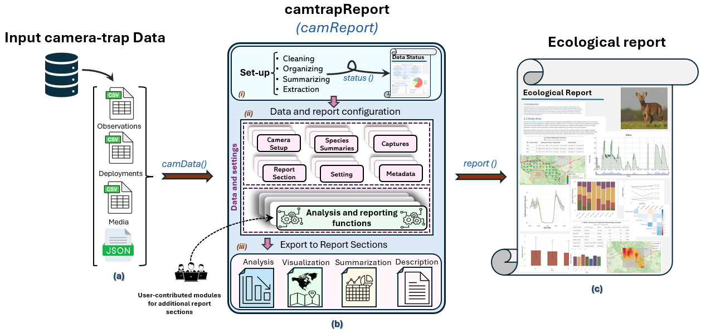

<!-- README.md is generated from README.Rmd. Edit README.Rmd, not README.md. -->

<h1 align="center">

camtrapReport
</h1>

<p align="center">

<em>Reproducible reporting for camera-trap monitoring data</em>
</p>

<p align="center">

<a href="https://github.com/spatialecology/camtrapReport/actions/workflows/R-CMD-check.yaml"></a>
<a href="https://github.com/spatialecology/camtrapReport/actions/workflows/pkgcheck.yaml"></a>
<a href="https://app.codecov.io/github/spatialecology/camtrapReport"></a>
<a href="https://www.repostatus.org/#active"></a>
<a href="https://www.r-project.org/"></a>
<a href="https://github.com/spatialecology/camtrapReport/blob/main/LICENSE.md"></a>
<a href="https://spatialecology.github.io/camtrapReport/"></a>
</p>

------------------------------------------------------------------------

`camtrapReport` converts camera-trap data in [Camtrap
DP](https://camtrap-dp.tdwg.org/) format into two coordinated HTML
outputs:

- a **Data Status Check**, which identifies issues in data completeness,
  consistency, annotation, and spatiotemporal coverage; and
- an **Ecological Report**, which combines selected ecological
  summaries, analyses, figures, tables, maps, metadata, and explanatory
  text in a configurable report.

The package focuses on the reporting workflow. It complements tools for
camera-trap data management and specialised ecological modelling rather
than replacing them.

<p align="center">

<br>
<em>Overview of the camtrapReport workflow.</em>
</p>

## Use in practice

Although `camtrapReport` has not yet been applied in a published
ecological study, it has been developed and evaluated using real-world
camera-trap monitoring datasets from multiple study sites across North
America, Asia, Europe, Africa, and Australia. Evaluation involved both
developer-led testing and independent users who applied the package to
their own datasets and provided feedback. In Europe, this evaluation has
drawn particularly on datasets available through camera-trap research
networks, including the [European Observatory of Wildlife
network](https://enetwild.com/), which spans diverse geographic settings
and monitoring designs.

Experience across these heterogeneous datasets has informed checks for
metadata completeness and spatiotemporal coverage, improvements to
report generation, and revisions based on user feedback. Related
publications, presentations, and training activities are listed on the
[Resources
page](https://spatialecology.github.io/camtrapReport/articles/resources.html).

## Installation

`camtrapReport` requires R 4.1.0 or later. Install it from GitHub with
[`pak`](https://pak.r-lib.org/):

``` r
if (!requireNamespace("pak", quietly = TRUE)) {
  install.packages("pak")
}

pak::pkg_install(
  "spatialecology/camtrapReport"
)
```

If you add or update report modules, check their dependencies with:

``` r
camtrapReport::install_All()
```

`install_All()` scans the bundled and registered user modules and
installs any missing dependencies automatically.

## Quick start

This executed example uses a compact Camtrap DP dataset derived from
**GMU8_LEUVEN**, together with bundled habitat data and a study-area
boundary. The dataset is copied to a temporary directory because
`camData()` may store processed files beside writable input data.

``` r
library(camtrapReport)

example_root <- tempfile("camtrapReport-example-")

dir.create(
  example_root,
  recursive = TRUE
)

copied <- file.copy(
  from = system.file(
    "external",
    "dataset",
    package = "camtrapReport",
    mustWork = TRUE
  ),
  to = example_root,
  recursive = TRUE,
  copy.mode = FALSE
)

habitat <- utils::read.csv(
  system.file(
    "external",
    "habitat",
    "habitat.csv",
    package = "camtrapReport",
    mustWork = TRUE
  )
)

study_area <- system.file(
  "external",
  "study_area",
  "study_area.shp",
  package = "camtrapReport",
  mustWork = TRUE
)
```

``` r
cm <- camData(
  data = file.path(example_root, "dataset"),
  habitat = habitat,
  study_area = study_area,
  update = TRUE
)
```

``` r
cm
#> Camera trap Object for the site : GMU8 LEUVEN 
#> ===================================================== 
#> Total number of sequences       :  10182 
#> Total number of observations    :  10798 
#> Total number of animals         :  4693 
#> Total number of detected species:  41 
#> Date/time (years) with data     :  2018, 2019, 2020, 2021, 2022, and 2023 
#> -----------------------------------------------------
```

`camData()` also accepts a Camtrap DP ZIP archive or an extracted
Camtrap DP directory. Habitat data and a study-area boundary are
optional.

### Generate a Data Status Check

``` r
status_file <- status(
  cm,
  view = FALSE
)
```

### Generate an Ecological Report

``` r
report_file <- report(
  cm,
  view = FALSE
)
```

## Configure a report

Inspect report metadata and choose which sections to include:

``` r
info(
  cm,
  name = c("title", "authors")
)

section_names()

selected_sections <- section_names(
  keep = c(
    "introduction",
    "methods",
    "study_area",
    "sampling",
    "effort"
  )
)

sections(
  cm,
  selected_sections
)
```

Reports can also be configured by taxonomic group, survey year, and
observation-count threshold. See the [Ecological
Report](https://spatialecology.github.io/camtrapReport/articles/ecological-report.html)
and [Module
management](https://spatialecology.github.io/camtrapReport/articles/modules.html)
guides for further examples.

Use `gui(cm)` to configure and generate reports through an interactive
interface.

## Interpretation and reproducibility

A successful Data Status Check confirms that the implemented data checks
were completed; it does not establish that the survey design or data are
suitable for a particular ecological analysis. Results should be
interpreted in relation to sampling effort, detectability, season,
habitat, and method-specific assumptions.

For reproducibility, retain the input data, optional inputs, analytical
settings, selected report sections, and relevant package versions.
General guidance is available from the [Reproducible Research CRAN Task
View](https://cran.r-project.org/view=ReproducibleResearch).

Reports may contain maps or derived results that reveal sensitive
species locations. Review all content before sharing a report.

## Example-data provenance

The bundled example dataset is derived from the [GMU8_LEUVEN Camtrap DP
dataset](https://doi.org/10.15468/4u3wm4), published by the Research
Institute for Nature and Forest (INBO) through GBIF. It contains 8
derived location identifiers, 87 deployments, 15,492 retained media
records, and 11,092 observation records. The relationship-preserving
subset is intended for demonstration and software testing, not
ecological inference. Its preparation and media-reduction rules are
documented in the [example-data
README](https://github.com/spatialecology/camtrapReport/blob/main/inst/external/README-Leuven-dataset.md).

## Relationship to other camera-trap packages

Several R packages support related parts of camera-trap workflows:

- [`camtrapdp`](https://inbo.github.io/camtrapdp/) reads, validates, and
  transforms Camtrap DP datasets;
- [`camtraptor`](https://inbo.github.io/camtraptor/) supports
  exploration and visualisation; and
- [`camtrapR`](https://jniedballa.github.io/camtrapR/) and
  [`ct`](https://cran.r-project.org/package=ct) provide broader
  data-management and analysis workflows.

`camtrapReport` complements these packages by integrating data-status
checks, selected ecological analyses, figures, maps, tables, metadata,
and explanatory text within a configurable reporting workflow. Its
extensible module framework allows users to incorporate additional
analyses and report components without modifying the core package. To
our knowledge, it is the first R package designed specifically to
automate the generation of both data-status and ecological reports from
camera-trap data.

## Documentation and support

- [Get started](https://spatialecology.github.io/camtrapReport/)
- [Package
  overview](https://spatialecology.github.io/camtrapReport/articles/Package-Overview.html)
- [Data Status
  Check](https://spatialecology.github.io/camtrapReport/articles/data-status-report.html)
- [Ecological
  Report](https://spatialecology.github.io/camtrapReport/articles/ecological-report.html)
- [Module
  management](https://spatialecology.github.io/camtrapReport/articles/modules.html)
- [Function
  reference](https://spatialecology.github.io/camtrapReport/reference/index.html)
- [Issue
  tracker](https://github.com/spatialecology/camtrapReport/issues)
- [GitHub repository](https://github.com/spatialecology/camtrapReport)

## Citation

Obtain the package citation with:

``` r
citation("camtrapReport")
```

## Author

`camtrapReport` is developed and maintained by [Elham
Ebrahimi](https://orcid.org/0000-0001-5191-9832).

## Contributing

Bug reports, feature requests, documentation improvements, code
contributions, and new report modules are welcome. Please read the
[contributing
guidelines](https://github.com/spatialecology/camtrapReport/blob/main/.github/CONTRIBUTING.md)
and [Code of
Conduct](https://github.com/spatialecology/camtrapReport/blob/main/.github/CODE_OF_CONDUCT.md)
before contributing.
