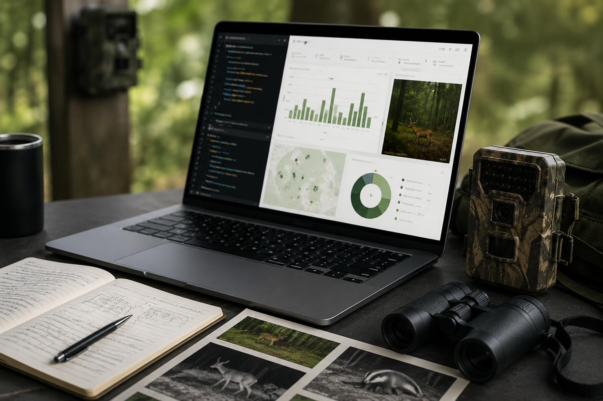

# Resources

This page lists publications, workshops, and training activities related
to `camtrapReport`. It is intended as a central place for users to find
scientific outputs, tutorials, and workshop information.

## Publications

The following publications describe `camtrapReport` or related
workflows.

Conference abstract

Automating camera-trap data reporting for wildlife monitoring

Ebrahimi, E., Stubbe, A., Dijkhuis, L., de Knegt, H., Liefting, Y., &
Jansen, P. A. (2025). Automating camera-trap data reporting for wildlife
monitoring. *IX European Congress of Mammalogy (ECM9)*, Patras, Greece,
31 March – 4 April 2025.

[View publication](https://doi.org/10.5281/zenodo.15721045)

Conference abstract

CamtrapReport: An R package for automating camera-trap data reporting
for wildlife monitoring

Ebrahimi, E., & Jansen, P. A. (2026). CamtrapReport: An R package for
automating camera-trap data reporting for wildlife monitoring. *The
International Biogeography Society – 12th Biennial Conference*, Aarhus,
Denmark, 5–10 January 2026.

[View publication](https://doi.org/10.5281/zenodo.18405441)

Conference abstract

camtrapReport: An R package for automating camera-trap data reporting
for wildlife monitoring

Ebrahimi, E., Stubbe, A., Dijkhuis, L. R., Liefting, Y., de Knegt, H.
J., & Jansen, P. A. (2026). camtrapReport: An R package for automating
camera-trap data reporting for wildlife monitoring. *Netherlands Annual
Ecology Meeting (NAEM 2026)*, Lunteren, the Netherlands, 10–11 February
2026.

[View publication](https://doi.org/10.5281/zenodo.20774222)

## Workshops and training

This section lists workshops, tutorials, and training activities related
to `camtrapReport`.

Training workshop

An overview of the functionality of `camtrapReport`: An R package for
automating camera-trap data reporting in wildlife monitoring

**Host:** TrapLab community, Utrecht University, Utrecht, the
Netherlands  
**Date:** May 4, 2026

Technical workshop

`camtrapReport`: A modular R package for automating camera-trap data
reporting in wildlife monitoring

**Host:** Research Institute for Nature and Forest (INBO), Brussels,
Belgium  
**Date:** May 29, 2026

Upcoming workshops

## Community and contact

`camtrapReport` is designed for the camera-trap community.
Organisations, research teams, and camera-trap networks interested in
arranging workshops, exploring collaboration opportunities, or
contributing new `camtrapReport` modules are welcome to get in touch by
email at <e.ebrahimi@uu.nl> or via
[LinkedIn](https://www.linkedin.com/in/elham-ebrahimi-90b519b8/).
