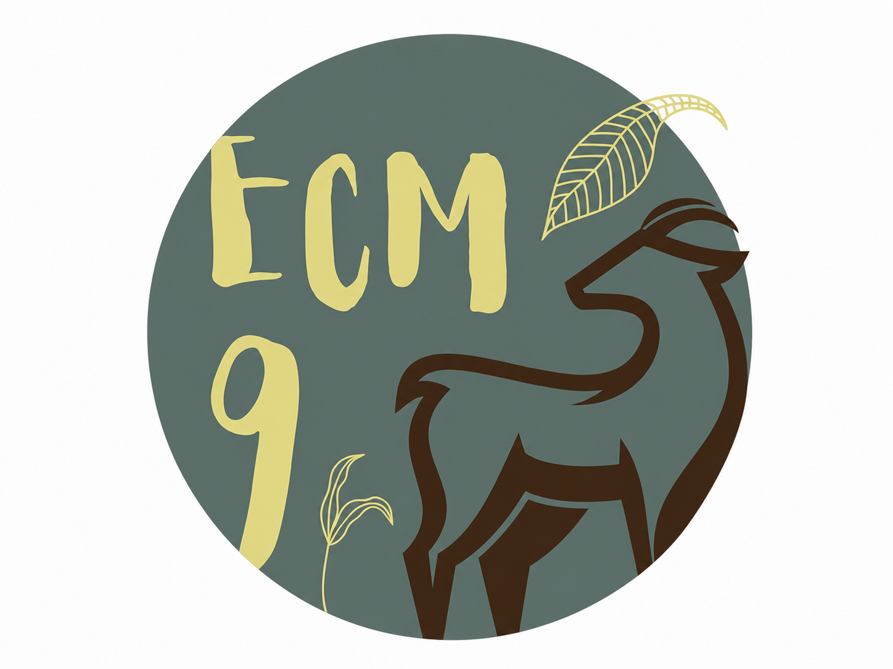
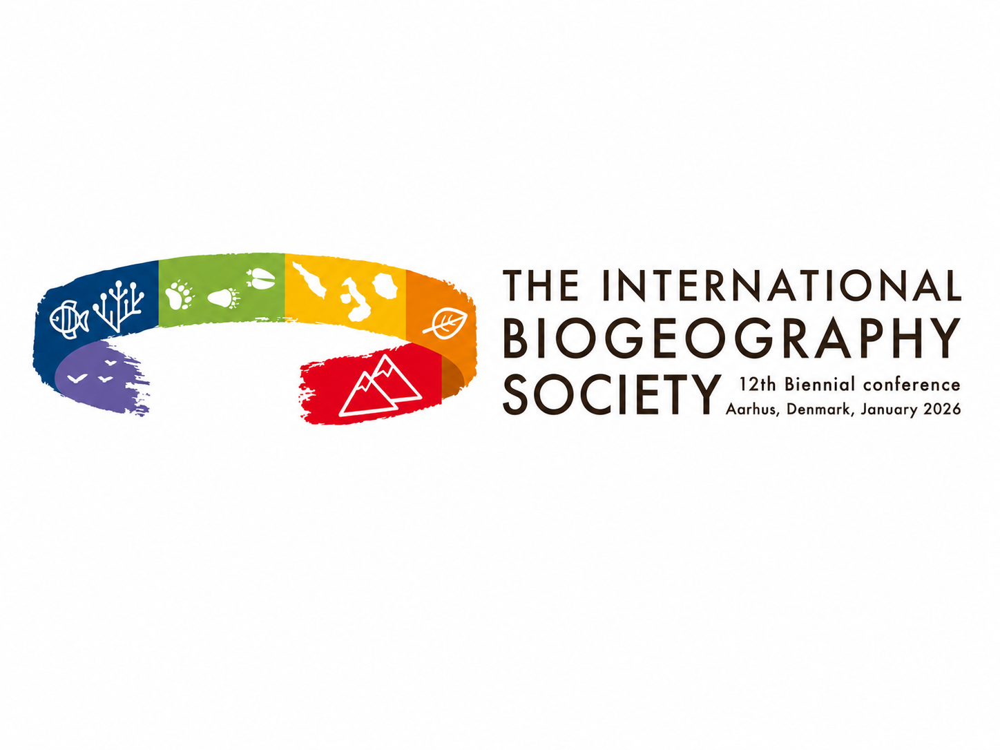
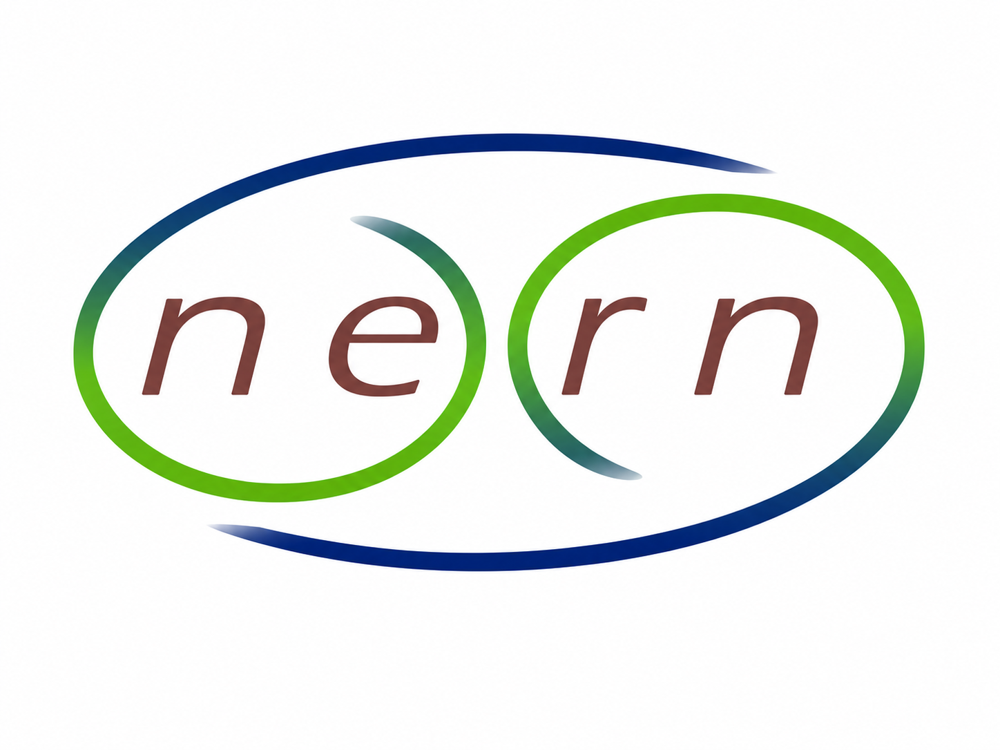

---
output:
  pdf_document: default
  html_document: default
---
# Resources

This page lists publications, workshops, and training activities related to `camtrapReport`. It is intended as a central place for users to find scientific outputs, tutorials, and workshop information.

## Publications

The following publications describe `camtrapReport` or related workflows.

Conference abstract

Automating camera-trap data reporting for wildlife monitoring

Ebrahimi, E., Stubbe, A., Dijkhuis, L., de Knegt, H., Liefting, Y., & Jansen, P. A. (2025). Automating camera-trap data reporting for wildlife monitoring. <em>IX European Congress of Mammalogy (ECM9)</em>, Patras, Greece, 31 March – 4 April 2025.

<a href="https://doi.org/10.5281/zenodo.15721045">View publication</a>

Conference abstract

CamtrapReport: An R package for automating camera-trap data reporting for wildlife monitoring

Ebrahimi, E., & Jansen, P. A. (2026). CamtrapReport: An R package for automating camera-trap data reporting for wildlife monitoring. <em>The International Biogeography Society – 12th Biennial Conference</em>, Aarhus, Denmark, 5–10 January 2026.

<a href="https://doi.org/10.5281/zenodo.18405441">View publication</a>

Conference abstract

camtrapReport: An R package for automating camera-trap data reporting for wildlife monitoring

Ebrahimi, E., Stubbe, A., Dijkhuis, L. R., Liefting, Y., de Knegt, H. J., & Jansen, P. A. (2026). camtrapReport: An R package for automating camera-trap data reporting for wildlife monitoring. <em>Netherlands Annual Ecology Meeting (NAEM 2026)</em>, Lunteren, the Netherlands, 10–11 February 2026.

<a href="https://doi.org/10.5281/zenodo.20774222">View publication</a>

## Workshops and training

This section lists workshops, tutorials, and training activities related to `camtrapReport`.

Training workshop

An overview of the functionality of <code>camtrapReport</code>: An R package for automating camera-trap data reporting in wildlife monitoring

<strong>Host:</strong> TrapLab community, Utrecht University, Utrecht, the Netherlands 
<strong>Date:</strong> May 4, 2026

Technical workshop

<code>camtrapReport</code>: A modular R package for automating camera-trap data reporting in wildlife monitoring

<strong>Host:</strong> Research Institute for Nature and Forest (INBO), Brussels, Belgium 
<strong>Date:</strong> May 29, 2026

Upcoming workshops

## Community and contact

`camtrapReport` is designed for the camera-trap community. Organisations, research teams, and camera-trap networks interested in arranging workshops, exploring collaboration opportunities, or contributing new `camtrapReport` modules are welcome to get in touch by email at [e.ebrahimi@uu.nl](mailto:e.ebrahimi@uu.nl) or via [LinkedIn](https://www.linkedin.com/in/elham-ebrahimi-90b519b8/).
