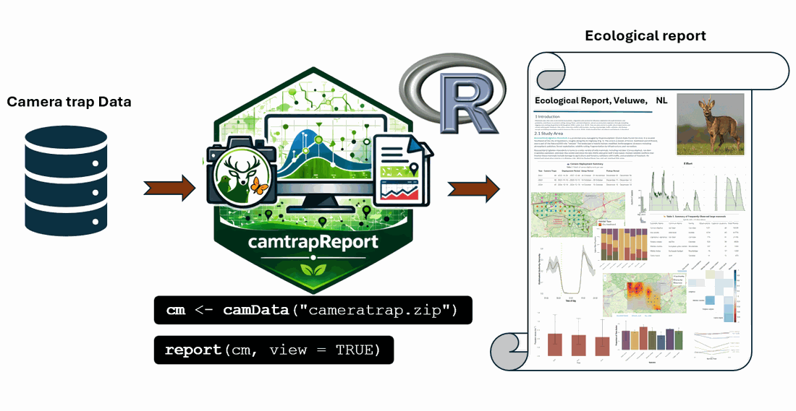
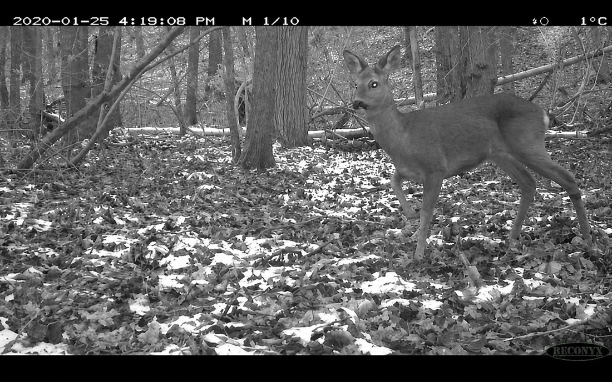
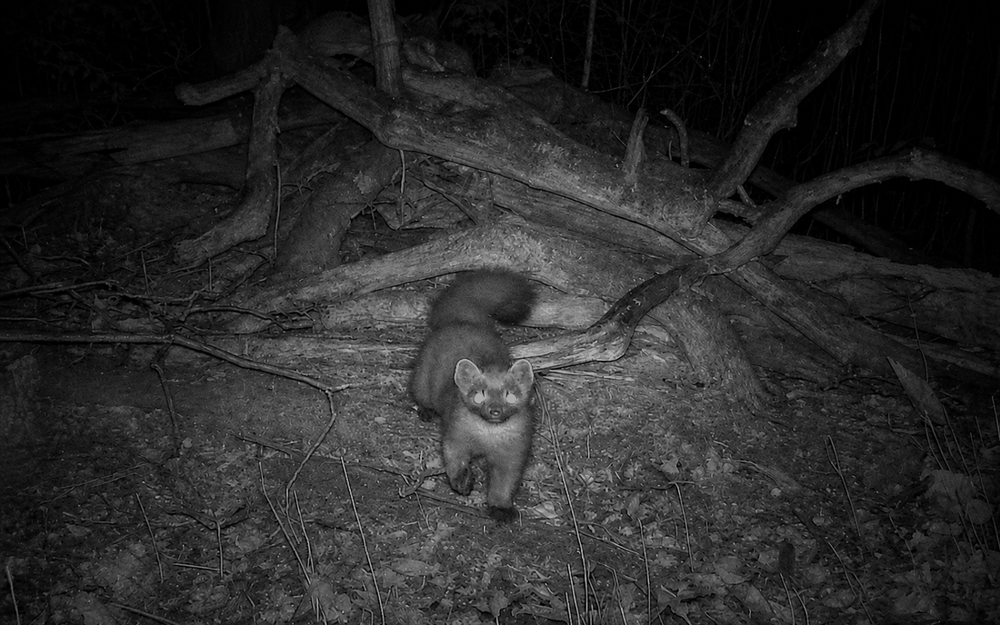
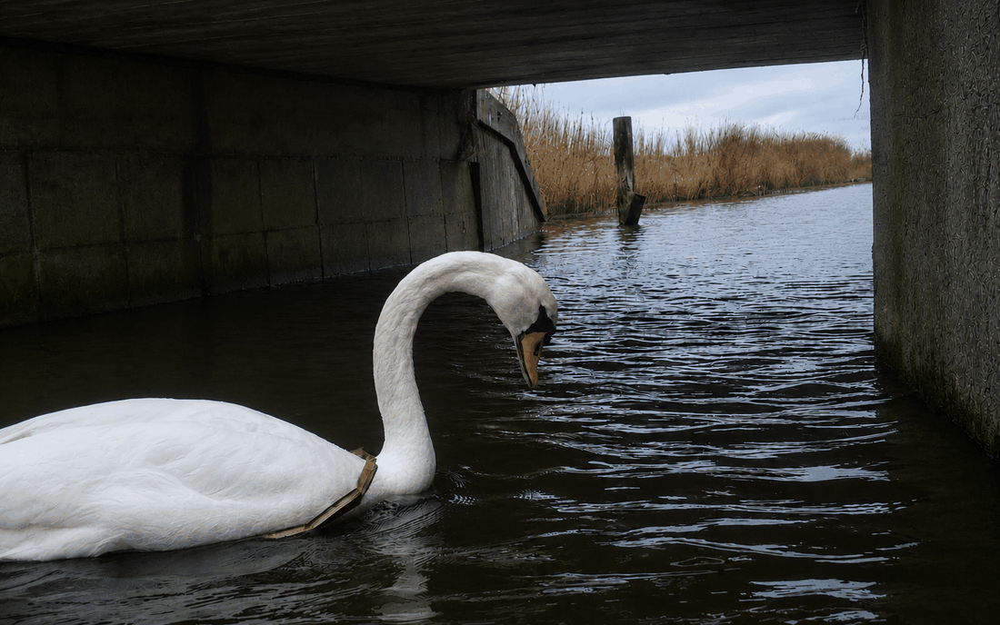
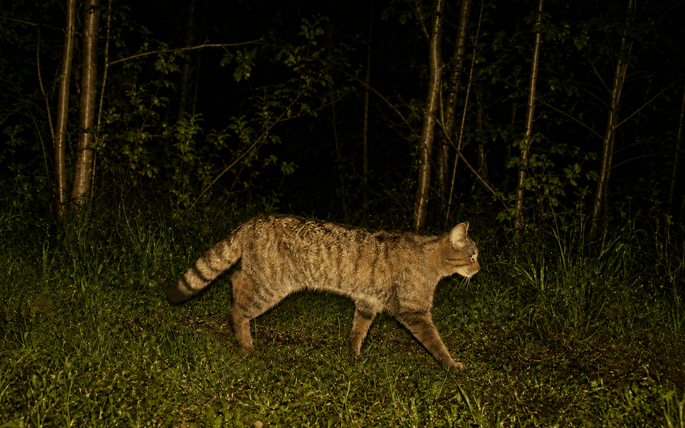
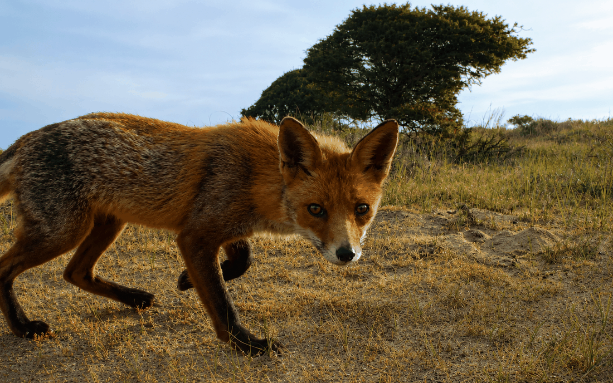

## Purpose of the Ecological Report

The Ecological Report is the main output of `camtrapReport`. It automatically
combines camera-trap data with narrative text, tables, figures, maps, and
selected ecological analyses in a reproducible HTML document. Its contents
depend on the available data and enabled report modules and can include study
context, sampling effort, species detections, activity patterns, spatial
patterns, and community summaries.


<style>
.figure .caption,
figcaption,
p.caption {
  text-align: center;
  font-size: 0.85rem;
  font-weight: 500;
  color: #555555;
}
</style>

```{r ecological-report-workflow, echo=FALSE, out.width="100%", fig.align="center", fig.cap="Figure 1. Workflow for generating an Ecological Report from camera-trap data using camtrapReport.", fig.alt="Workflow for generating an Ecological Report from camera-trap data using camtrapReport."}

```


Figure 1 summarises the automated workflow. `camData()` reads and prepares the
camera-trap dataset. `report()` then runs the selected modules and generates
the complete HTML Ecological Report.

```{r ecological-report-basic-workflow, eval=FALSE}
cm <- camData("path/to/camtrap-dp-dataset")
report(cm, view = TRUE)
```

These two function calls are sufficient for the standard workflow. With
`view = TRUE`, the report opens in the browser. `report()` also invisibly
returns the path to the generated HTML file.

To retain the report at a chosen location, supply a filename in an existing
output directory:

```{r ecological-report-output-path, eval=FALSE}
report_file <- report(cm, filename = "reports/ecological_report_2026", view = FALSE)
```

If `filename` is omitted, the HTML file and its intermediate R Markdown file
are written to the R session's temporary directory. Use distinct filenames
when reports from several datasets, settings, or processing dates must be
retained.

<hr class="section-divider">


## Example Ecological Reports

Below are previews of Ecological Reports generated with `camtrapReport` for different camera-trap monitoring projects. Click a preview to open the corresponding complete report. Reports can also be generated locally from a Camtrap DP dataset using the workflow described above.


<style>

.eco-gallery {

  display: grid;

  grid-template-columns: repeat(2, minmax(0, 1fr));

  gap: 1.5rem;

  max-width: 1050px;

  margin: 1.8rem auto 2.8rem auto;

}

.eco-card {

  position: relative;

  display: block;

  overflow: hidden;

  border-radius: 18px;

  background: #003b32;

  box-shadow: 0 8px 24px rgba(0, 0, 0, 0.16);

  text-decoration: none;

  color: #ffffff !important;

}

.eco-card img {

  width: 100%;

  height: 320px;

  object-fit: cover;

  display: block;

  transition: transform 0.25s ease, filter 0.25s ease;

}

.eco-card:hover img {

  transform: scale(1.05);

  filter: brightness(1.06);

}

.eco-card-overlay {

  position: absolute;

  inset: 0;

  background: linear-gradient(

    to top,

    rgba(0, 0, 0, 0.88),

    rgba(0, 0, 0, 0.42),

    rgba(0, 0, 0, 0.06)

  );

  display: flex;

  flex-direction: column;

  justify-content: flex-end;

  padding: 1.25rem;

}

.eco-card .eco-card-title {

  margin: 0 0 0.25rem 0;

  color: #ffffff !important;

  font-size: 1.35rem;

  line-height: 1.25;

  font-weight: 800 !important;

  text-shadow: 0 2px 8px rgba(0, 0, 0, 0.85);

}

.eco-card .eco-card-text {

  margin: 0;

  color: #ffffff !important;

  font-size: 1rem;

  line-height: 1.35;

  font-weight: 700 !important;

  text-shadow: 0 2px 8px rgba(0, 0, 0, 0.85);

}

.eco-card .eco-card-badge {

  display: inline-block;

  width: fit-content;

  margin-top: 0.75rem;

  padding: 0.30rem 0.80rem;

  border-radius: 999px;

  background: rgba(0, 0, 0, 0.35);

  border: 1px solid rgba(255, 255, 255, 0.75);

  color: #ffffff !important;

  font-size: 0.88rem;

  font-weight: 700 !important;

  text-shadow: 0 1px 5px rgba(0, 0, 0, 0.85);

}

.eco-card:hover,

.eco-card:focus,

.eco-card:hover .eco-card-title,

.eco-card:hover .eco-card-text,

.eco-card:hover .eco-card-badge {

  color: #ffffff !important;

  text-decoration: none;

}

.eco-card:last-child {

  grid-column: 1 / -1;

  width: calc(50% - 0.75rem);

  justify-self: center;

}

@media (max-width: 800px) {

  .eco-gallery {

    grid-template-columns: 1fr;

    max-width: 560px;

  }

  .eco-card:last-child {

    grid-column: auto;

    width: 100%;

  }

  .eco-card img {

    height: 300px;

  }

}

</style>

<div class="eco-gallery">

<a class="eco-card" href="https://spatialecology.github.io/camtrapReport/reports/leuven-ecological-report.html" target="_blank" rel="noopener noreferrer"><div class="eco-card-overlay"><div class="eco-card-title">Leuven</div><div class="eco-card-text">Belgium</div><span class="eco-card-badge">Open report</span></div></a>

<a class="eco-card" href="https://spatialecology.github.io/camtrapReport/reports/antwerp-ecological-report.html" target="_blank" rel="noopener noreferrer"><div class="eco-card-overlay"><div class="eco-card-title">Antwerp</div><div class="eco-card-text">Belgium</div><span class="eco-card-badge">Open report</span></div></a>

<a class="eco-card" href="https://spatialecology.github.io/camtrapReport/reports/mica-ecological-report.html" target="_blank" rel="noopener noreferrer"><div class="eco-card-overlay"><div class="eco-card-title">MICA Monitoring Project</div><div class="eco-card-text">Europe</div><span class="eco-card-badge">Open report</span></div></a>

<a class="eco-card" href="https://spatialecology.github.io/camtrapReport/reports/luxembourg-ecological-report.html" target="_blank" rel="noopener noreferrer"><div class="eco-card-overlay"><div class="eco-card-title">Lux National Monitoring</div><div class="eco-card-text">Luxembourg</div><span class="eco-card-badge">Open report</span></div></a>

<a class="eco-card" href="https://spatialecology.github.io/camtrapReport/reports/amsterdam-ecological-report.html" target="_blank" rel="noopener noreferrer"><div class="eco-card-overlay"><div class="eco-card-title">Amsterdam Water Supply Dunes</div><div class="eco-card-text">Netherlands</div><span class="eco-card-badge">Open report</span></div></a>

</div>

<hr class="section-divider">

## Customising the Ecological Report

The default workflow generates a complete report without further
configuration. When needed, the `camReport` object can be adjusted before
calling `report()`. Common options include report metadata, focal species
group, monitoring years, filtering thresholds, and included sections.


### Viewing and changing metadata

Report metadata are extracted or inferred from the input data. Use `info()` to
inspect them or change individual fields.


```{r ecological-report-custom-metadata, eval=FALSE}
info(cm)

info(cm, name = "title") <- "Camera-Trap Monitoring Report"
info(cm, name = "authors") <- "Research team"
```


### Adjusting the focus group

The report can focus on a predefined group such as `large_mammals`,
`wild_animals`, `birds`, `amphibians`, `domestic`, or `human_observation`.

```{r ecological-report-focus-group, eval=FALSE}
names(cm$group_definition)
cm$set_focus_group(x = "birds")
cm$setup()
```

A custom group can be defined from fields such as `scientificName`, `class`,
`order`, or `observationType`:

```{r ecological-report-custom-group, eval=FALSE}
cm$add_group(
  name = "target_species",
  x = list(
    scientificName = c(
      "Vulpes vulpes",
      "Capreolus capreolus",
      "Sus scrofa"
    )
  )
)

cm$set_focus_group("target_species")
cm$setup()
```


### Selecting years and adjusting filters

The default report uses the available monitoring period. To restrict the
analysis or change the minimum number of observations required for inclusion:

```{r ecological-report-years-filters, eval=FALSE}
cm$years <- 2023:2024
cm$filterCount <- 10
cm$setup()
report(cm, view = TRUE)
```

### Selecting which sections are included

Sections can be excluded when an analysis is not relevant or the report needs
to be shorter.

```{r ecological-report-select-sections, eval=FALSE}
selected_sections <- section_names(
  exclude = c("richness", "co_occurrence")
)
sections(cm, selected_sections)
report(cm, view = TRUE)
```

## Interpretation

The automated report summarises the implemented checks and selected analyses.
It does not establish that the survey design is suitable for a particular
ecological question or that the data satisfy all assumptions of the selected
methods. Results should be interpreted in relation to sampling effort,
detectability, season, habitat, data quality, and method-specific assumptions.
