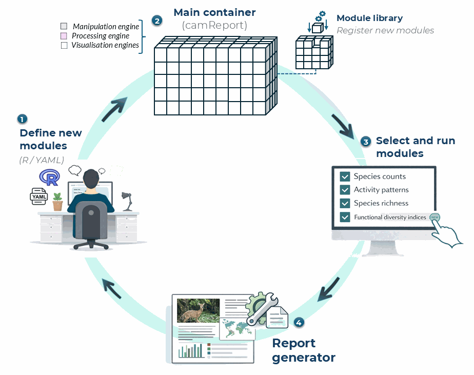

## Managing and extending report modules

The Ecological Report is built from separate report sections, here referred to as modules. Each module is a small report component that can contain explanatory text, R code, or both. This modular structure allows users to extend the report by adding new sections, modifying existing ones, or changing the order in which sections appear.

A new module is defined in a YAML file and then registered with `camtrapReport` using `add_Module()`. After the module has been added, it is useful to test it before generating the full report.


<style>
.figure .caption,
figcaption,
p.caption {
  text-align: center;
  font-size: 0.85rem;
  font-weight: 500;
  color: #555555;
}
</style>

```{r module-workflow, echo=FALSE, out.width="85%", fig.align="center", fig.cap="Figure 1. Modular workflow for defining, registering, selecting, and running report modules in *camtrapReport*.", fig.alt="Modular workflow for defining, registering, selecting, and running report modules in camtrapReport."}

```

Figure 1 summarises how new modules are added to the report workflow. A module can be defined using R code or a YAML file, registered in the module library, added to the main `camReport` object, tested separately, and then included when generating the final Ecological Report.

### 1. List existing modules

Before adding a new module, check which modules are already available in the package.

```{r list-existing-modules, eval=FALSE}
# List all available modules
list_Modules()

# Show all section names used in the report
section_names()
```

### 2. Create a new module YAML file

A module can be written as a YAML file. The example below defines a simple module called `species_table`, which adds a species summary table to the Ecological Report.

Create a file called `species_table.yml` and save it in your working directory.

~~~yaml
name: species_table
title: "Species summary table"
parent: "results"
text: "This section provides a summary of the species detected in the camera-trap dataset, including their taxonomy and total number of captures."

code: |
  #| echo: false
  #| message: false
  #| warning: false

  species_table <- object$data_status$Species$Table

  if (!is.null(species_table) && nrow(species_table) > 0) {
    knitr::kable(
      species_table,
      caption = "Species detected in the camera-trap dataset."
    )
  } else {
    cat("No species table is available for this dataset.")
  }
~~~

The `name` field defines the internal module name. The `title` field controls the section title shown in the report. The `parent` field defines where the module belongs in the report structure, for example under `methods` or `results`. The `text` field adds explanatory text, and the `code` field contains the R code used to generate the module output.

A scientific module should also document its purpose, required input fields, packages, preprocessing decisions, method assumptions, returned output, and interpretation limits. Prefer deterministic code, avoid modifying global state or source data, and qualify package calls explicitly where practical. If randomness is required, set and document a reproducible seed. Never place passwords, access tokens, personal data, or machine-specific absolute paths in a module file.

### 3. Add the new module

Module registries that are changed by users must be kept outside the installed
package directory. Start by copying the bundled registry to a writable project
directory, then add the new module to that copy. In this example,
`species_table` is placed before the `richness` section.

```{r add-new-module, eval=FALSE}
# Create a writable project-level module registry once
bundled_modules <- system.file(
  "reportSections",
  package = "camtrapReport"
)
module_dir <- file.path(getwd(), "reportSections")

if (!dir.exists(module_dir)) {
  dir.create(module_dir)
  file.copy(
    list.files(bundled_modules, full.names = TRUE),
    module_dir,
    recursive = TRUE
  )
}

# Add a new module from a YAML file
added <- add_Module(
  x = "species_table.yml",
  before = "richness",
  test = FALSE,
  object = cm,
  dir = module_dir
)

# Check whether the module has been added
list_Modules(dir = module_dir)
```

You can change `before = "richness"` to another section name if you want the new module to appear elsewhere in the report.

### 4. Install module dependencies

The module registry is registered automatically when `add_Module()` is called.
`install_All()` then scans the `#| packages:` options of all bundled and
user-managed modules and delegates installation to `pak`.

```{r install-module-dependencies, eval=FALSE}
# Discover and install all dependencies declared by all modules
install_All()
```

Additional CRAN packages can be included explicitly. Known GitHub dependencies
configured by `camtrapReport` are included by default, and configured GitLab
dependencies can be included with `gitlab = TRUE`:

```{r install-module-github-dependency, eval=FALSE}
install_All(pkgs = "readr")
install_All(gitlab = TRUE)
```

If a user module depends on an unconfigured non-CRAN repository, install that
repository explicitly with `pak::pkg_install()` before rendering the module.

### 5. Add the module to the current camReport object

The object returned by `add_Module()` contains the parsed module. Attach it to
the current report object and confirm that it appears in the report catalogue.

```{r update-current-object, eval=FALSE}
cm$addReportObject(added$module)
listReportSections(cm)
```

### 6. Test the new module

Before generating the full report, test only the new module. This is useful for checking whether the YAML structure, text, and R code work correctly.

```{r test-new-module, eval=FALSE}
# Test the new module only
testSection(
  added$module,
  object = cm,
  view = TRUE
)
```

If the module opens correctly in the browser, it can be included in the full report.

### 7. Generate the full report

After testing, generate the full Ecological Report with the new module included.

```{r generate-report-with-new-module, eval=FALSE}
# Generate the full report
report(cm, view = TRUE)
```

This workflow allows users to extend the Ecological Report with project-specific outputs, additional summaries, new figures, or custom interpretation sections.

## Reordering, removing, and restoring modules

Module changes can be inspected and reversed before anything is deleted permanently:

```{r manage-existing-modules, eval=FALSE}
# Validate active module definitions and inspect the hierarchy
list_Modules(validate = TRUE, dir = module_dir)

# Move a module within the report hierarchy
move_Module(
  "species_table",
  after = "captures",
  parent = "results",
  dir = module_dir
)

# Move a module and its children to the module trash
remove_Module("species_table", recursive = TRUE, dir = module_dir)

# Inspect active and deleted modules
list_Modules(include_trash = TRUE, dir = module_dir)

# Restore a removed module
restore_Module("species_table", test = TRUE, dir = module_dir)
```

`empty_trash()` permanently deletes trashed module definitions and should only be used after confirming that the YAML files are backed up elsewhere. After any registry change, recreate or rerun `setup()` on the `camReport` object, confirm the selected sections with `listReportSections(cm)`, test affected modules, and generate the complete report in a new output file. Review the resulting text, tables, figures, warnings, and citations as carefully as any manually written scientific analysis.
