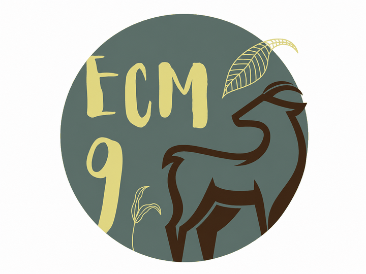
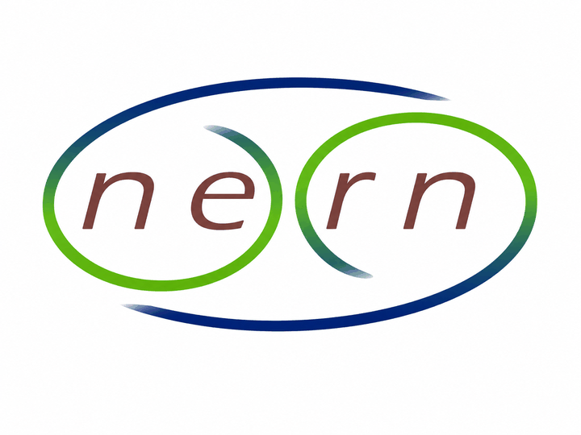

This page presents publications, workshops, and training activities related to `camtrapReport`. It provides a central place for users to find scientific outputs, learning materials, and opportunities to engage with the `camtrapReport` community.

## Publications

The following publications present `camtrapReport` or related workflows for standardising and automating camera-trap data reporting.

Conference abstract

Automating camera-trap data reporting for wildlife monitoring

Ebrahimi, E., Stubbe, A., Dijkhuis, L., de Knegt, H., Liefting, Y., &amp; Jansen, P. A. (2025). Automating camera-trap data reporting for wildlife monitoring. <em>IX European Congress of Mammalogy (ECM9)</em>, Patras, Greece, 31 March–4 April 2025.

<a href="https://doi.org/10.5281/zenodo.15721045" target="_blank" rel="noopener noreferrer">View publication</a>

Conference abstract

camtrapReport: An R package for automating camera-trap data reporting for wildlife monitoring

Ebrahimi, E., &amp; Jansen, P. A. (2026). camtrapReport: An R package for automating camera-trap data reporting for wildlife monitoring. <em>The International Biogeography Society 12th Biennial Conference</em>, Aarhus, Denmark, 5–10 January 2026.

<a href="https://doi.org/10.5281/zenodo.18405441" target="_blank" rel="noopener noreferrer">View publication</a>

Conference abstract

camtrapReport: An R package for automating camera-trap data reporting for wildlife monitoring

Ebrahimi, E., Stubbe, A., Dijkhuis, L. R., Liefting, Y., de Knegt, H. J., &amp; Jansen, P. A. (2026). camtrapReport: An R package for automating camera-trap data reporting for wildlife monitoring. <em>Netherlands Annual Ecology Meeting (NAEM 2026)</em>, Lunteren, the Netherlands, 10–11 February 2026.

<a href="https://doi.org/10.5281/zenodo.20774222" target="_blank" rel="noopener noreferrer">View publication</a>

## Workshops and training

The following workshops and training activities introduce the functionality of `camtrapReport` and demonstrate how it can support reproducible camera-trap data processing, assessment, analysis, and reporting.

Training workshop

An overview of the functionality of <code>camtrapReport</code>: An R package for automating camera-trap data reporting in wildlife monitoring

<strong>Host:</strong> TrapLab community, Utrecht University, Utrecht, the Netherlands 
<strong>Date:</strong> 4 May 2026

Technical workshop

<code>camtrapReport</code>: A modular R package for automating camera-trap data reporting in wildlife monitoring

<strong>Host:</strong> Research Institute for Nature and Forest (INBO), Brussels, Belgium 
<strong>Date:</strong> 29 May 2026

## Community and contact

`camtrapReport` is developed for the camera-trap research and conservation community. Organisations, research teams, and camera-trap networks interested in arranging workshops, exploring collaboration opportunities, testing the package, or contributing new `camtrapReport` modules are welcome to get in touch.

Contact [Elham Ebrahimi by email](mailto:e.ebrahimi@uu.nl) or connect via [LinkedIn](https://www.linkedin.com/in/elham-ebrahimi-90b519b8/).
