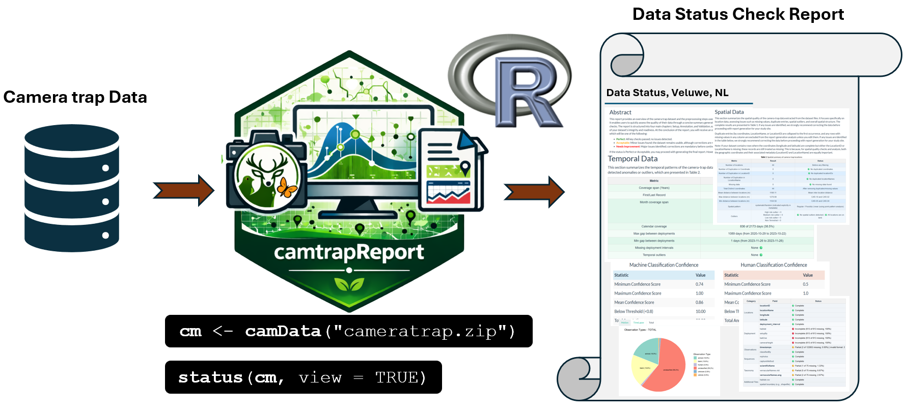
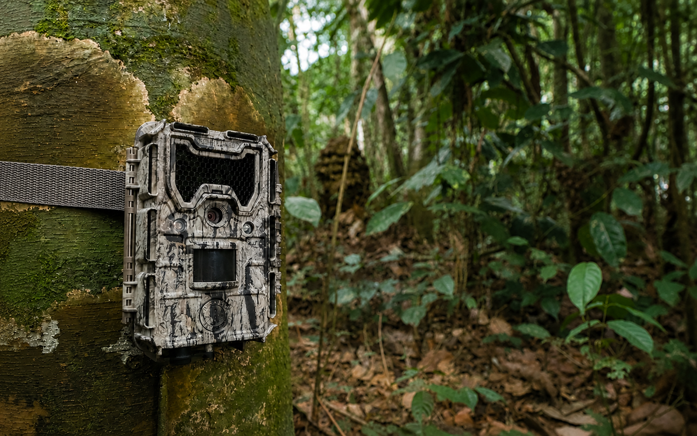

## Data Status Report

The Data Status Report provides an overview of the quality, completeness, and readiness of a camera-trap dataset before generating the final Ecological Report. It helps users check whether the main input files, metadata fields, deployment information, observation records, taxonomy, timestamps, annotation information, and spatial data are complete and internally consistent.

This report is especially useful as a first quality-control step. It allows users to identify missing values, duplicated records, invalid timestamps, incomplete metadata, spatial issues, and inconsistencies between deployments and observations. Based on these checks, users can decide whether the dataset is ready for reporting or whether further correction is needed before ecological analyses are performed.

<style>
.figure .caption,
figcaption,
p.caption {
  text-align: center;
  font-size: 0.85rem;
  font-weight: 500;
  color: #555555;
}
</style>

```{r data-status-workflow, echo=FALSE, out.width="100%", fig.cap="Figure 1. Workflow for generating a Data Status Report from camera-trap data using camtrapReport."}

```

Figure 1 summarises how `camtrapReport` checks the readiness of a camera-trap dataset before ecological reporting. After the data are loaded with `camData()`, the `status()` function runs automated checks on the main input files, metadata, deployments, observations, timestamps, taxonomy, spatial information, and annotation records. The output helps users identify potential issues and decide whether the dataset is ready for generating the final Ecological Report.

```{r data-status-basic-code, eval=FALSE}
library(camtrapReport)

# Load camera-trap data
cm <- camData("cameratrap.zip")

# Generate and view the Data Status Report
status(cm, view = TRUE)
```

When `view = TRUE`, the generated report is opened in the browser. This provides a quick, human-readable overview of dataset quality, completeness, and consistency.


<hr class="section-divider">

## Example Data Status Reports

Below are example Data Status Reports generated with `camtrapReport` for different camera-trap monitoring projects. These examples show how the report can be used to assess dataset completeness, detect possible issues, and evaluate whether the data are ready for ecological reporting. Click on an image to open the full HTML report.

<style>
.status-gallery {
  display: grid;
  grid-template-columns: repeat(2, minmax(0, 1fr));
  gap: 1.5rem;
  max-width: 1050px;
  margin: 1.8rem auto 2.8rem auto;
}

.status-card {
  position: relative;
  display: block;
  overflow: hidden;
  border-radius: 18px;
  background: #003b32;
  box-shadow: 0 8px 24px rgba(0, 0, 0, 0.16);
  text-decoration: none;
  color: #ffffff !important;
}

.status-card img {
  width: 100%;
  height: 320px;
  object-fit: cover;
  display: block;
  transition: transform 0.25s ease, filter 0.25s ease;
}

.status-card:hover img {
  transform: scale(1.05);
  filter: brightness(1.06);
}

.status-card-overlay {
  position: absolute;
  inset: 0;
  background: linear-gradient(
    to top,
    rgba(0, 0, 0, 0.88),
    rgba(0, 0, 0, 0.42),
    rgba(0, 0, 0, 0.06)
  );
  display: flex;
  flex-direction: column;
  justify-content: flex-end;
  padding: 1.25rem;
}

.status-card .status-card-title {
  margin: 0 0 0.25rem 0;
  color: #ffffff !important;
  font-size: 1.35rem;
  line-height: 1.25;
  font-weight: 800 !important;
  text-shadow: 0 2px 8px rgba(0, 0, 0, 0.85);
}

.status-card .status-card-text {
  margin: 0;
  color: #ffffff !important;
  font-size: 1rem;
  line-height: 1.35;
  font-weight: 700 !important;
  text-shadow: 0 2px 8px rgba(0, 0, 0, 0.85);
}

.status-card .status-card-badge {
  display: inline-block;
  width: fit-content;
  margin-top: 0.75rem;
  padding: 0.30rem 0.80rem;
  border-radius: 999px;
  background: rgba(0, 0, 0, 0.35);
  border: 1px solid rgba(255, 255, 255, 0.75);
  color: #ffffff !important;
  font-size: 0.88rem;
  font-weight: 700 !important;
  text-shadow: 0 1px 5px rgba(0, 0, 0, 0.85);
}

.status-card:hover,
.status-card:focus,
.status-card:hover .status-card-title,
.status-card:hover .status-card-text,
.status-card:hover .status-card-badge {
  color: #ffffff !important;
  text-decoration: none;
}

@media (max-width: 800px) {
  .status-gallery {
    grid-template-columns: 1fr;
    max-width: 560px;
  }

  .status-card img {
    height: 300px;
  }
}
</style>

<div class="status-gallery">

<a class="status-card" href="../reports/data_status_Leuven.html" target="_blank" rel="noopener"><div class="status-card-overlay"><div class="status-card-title">Leuven</div><div class="status-card-text">Data Status Report</div><span class="status-card-badge">Open report</span></div></a>

<a class="status-card" href="../reports/data_status_Amsterdam.html" target="_blank" rel="noopener"><div class="status-card-overlay"><div class="status-card-title">Amsterdam Water Supply Dunes</div><div class="status-card-text">Data Status Report</div><span class="status-card-badge">Open report</span></div></a>

<a class="status-card" href="../reports/data_status_Lux.html" target="_blank" rel="noopener"><div class="status-card-overlay"><div class="status-card-title">Lux National Monitoring</div><div class="status-card-text">Data Status Report</div><span class="status-card-badge">Open report</span></div></a>

<a class="status-card" href="../reports/data_status_MICA.html" target="_blank" rel="noopener"><div class="status-card-overlay"><div class="status-card-title">MICA Monitoring Project</div><div class="status-card-text">Data Status Report</div><span class="status-card-badge">Open report</span></div></a>

</div>

<hr class="section-divider">

## Exploring data-status results in R

The results of the data-status checks are also stored inside the `camReport` object. Users can explore these results directly in R through the `data_status` slot. This is useful when users want to inspect the underlying tables, extract summaries, or use the quality-control outputs in another workflow.

```{r data-status-explore-object, eval=FALSE}
# Explore all data-status outputs stored in the camReport object
cm$data_status

# Show the available data-status components
names(cm$data_status)

cm$data_status$Spatial
cm$data_status$Temporal
cm$data_status$Essentials
cm$data_status$Annotation
cm$data_status$Validation
cm$data_status$Species
cm$data_status$Visuals
```

For example, the species table can be inspected to check which species were detected and how many captures were recorded for each species.

```{r data-status-species-table, eval=FALSE}
# View species summary table
cm$data_status$Species$Table
```


Together, `status(cm, view = TRUE)` and `cm$data_status` provide both a human-readable HTML report and direct access to the underlying data-quality summaries in R. This makes the Data Status Report useful for documenting data readiness, identifying issues, and improving the dataset before generating the final Ecological Report.
