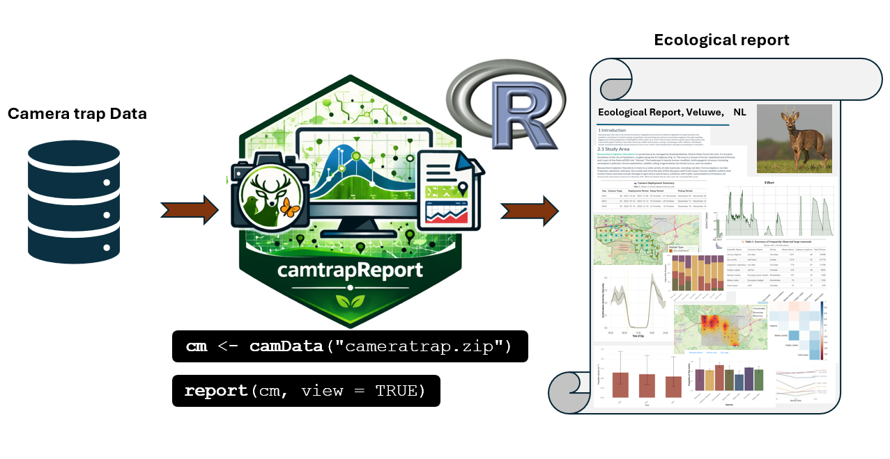
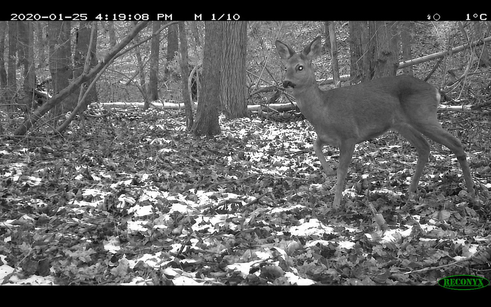
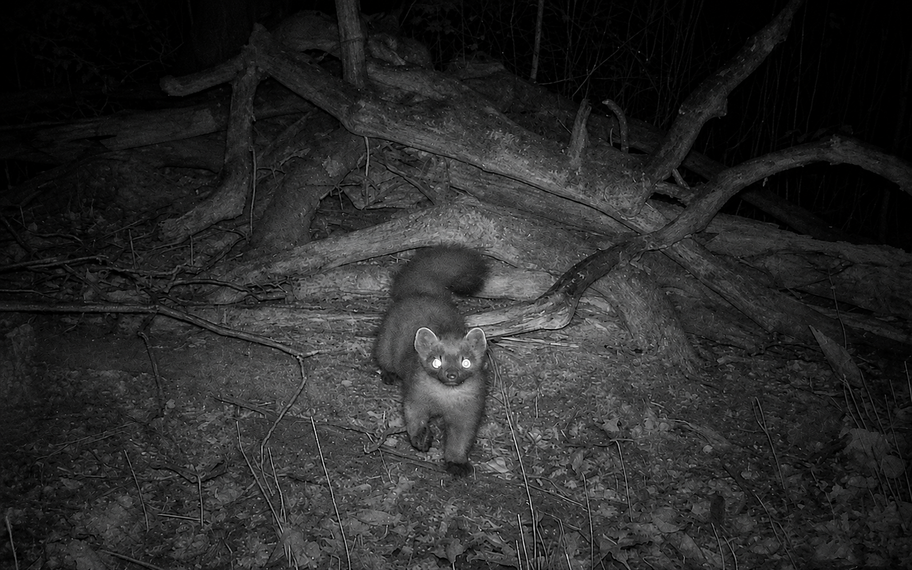
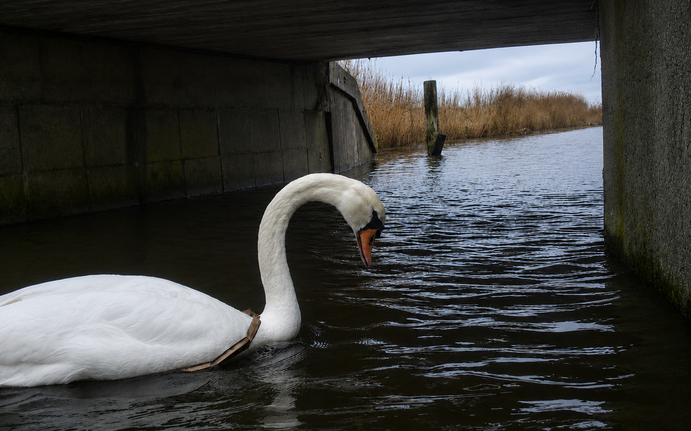
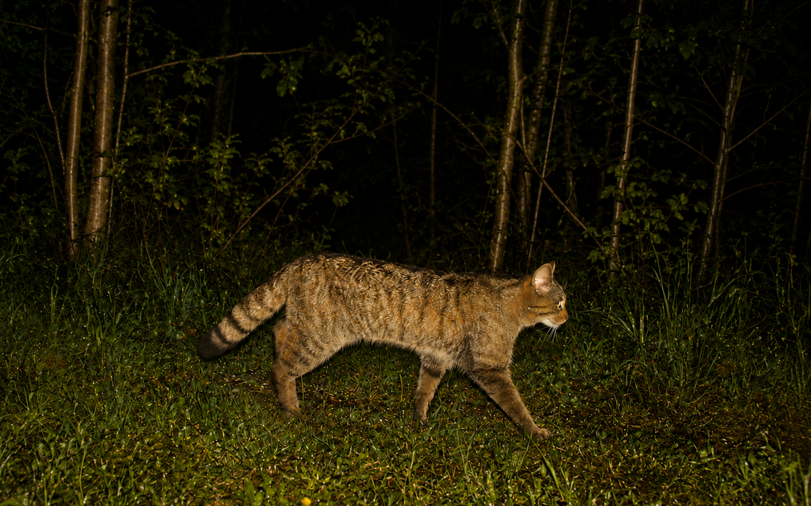
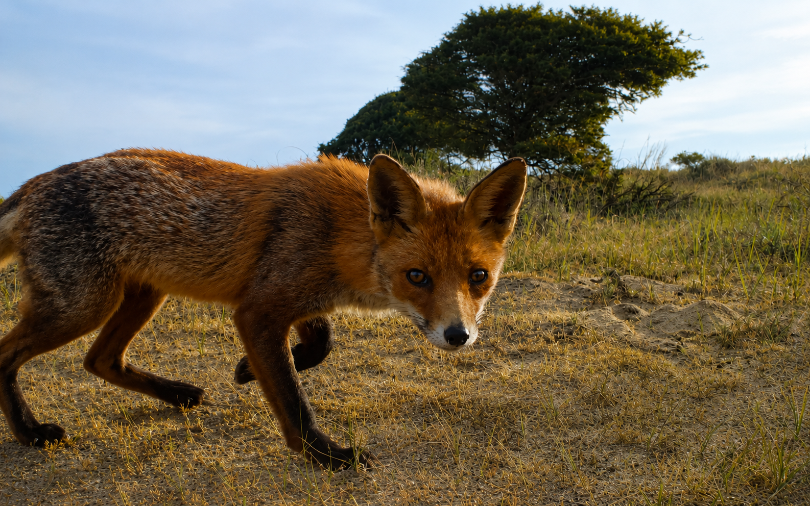

## Purpose of the Ecological Report 

The Ecological Report is the main interpretive output of `camtrapReport`. It brings processed camera-trap data together into a clear, scientific-style report with narrative text, tables, figures, and maps. The report summarises key information such as study context, sampling effort, species detections, activity patterns, spatial patterns, and ecological trends. It is designed to help researchers, conservation practitioners, and camera-trap users interpret, communicate, and share results in a reproducible way.

```{r ecological-report-workflow, echo=FALSE, out.width="100%", fig.cap="Workflow for generating an Ecological Report from camera-trap data using camtrapReport."}

```

The workflow starts with camera-trap input data, which are loaded using `camData()`. The `report()` function then generates a complete HTML Ecological Report with the selected narrative text, tables, figures, maps, and ecological summaries.

```{r ecological-report-basic-code, eval=FALSE}
library(camtrapReport)

# Load camera-trap data
cm <- camData("cameratrap.zip")

# Generate the Ecological Report
report(cm, view = TRUE)
```

## Example Ecological Reports

Below are example Ecological Reports generated with `camtrapReport` for different camera-trap monitoring projects. Click on an image to open the full HTML report.

<style>
.eco-gallery {
  display: grid;
  grid-template-columns: repeat(2, minmax(0, 1fr));
  gap: 1.5rem;
  max-width: 1050px;
  margin: 1.8rem auto 2.8rem auto;
}

.eco-card {
  position: relative;
  display: block;
  overflow: hidden;
  border-radius: 18px;
  background: #003b32;
  box-shadow: 0 8px 24px rgba(0, 0, 0, 0.16);
  text-decoration: none;
  color: #ffffff;
}

.eco-card img {
  width: 100%;
  height: 320px;
  object-fit: cover;
  display: block;
  transition: transform 0.25s ease, filter 0.25s ease;
}

.eco-card:hover img {
  transform: scale(1.05);
  filter: brightness(1.06);
}

.eco-card-overlay {
  position: absolute;
  inset: 0;
  background: linear-gradient(
    to top,
    rgba(0, 0, 0, 0.82),
    rgba(0, 0, 0, 0.30),
    rgba(0, 0, 0, 0.04)
  );
  display: flex;
  flex-direction: column;
  justify-content: flex-end;
  padding: 1.15rem;
}

.eco-card-title {
  margin: 0 0 0.25rem 0;
  color: #ffffff;
  font-size: 1.25rem;
  line-height: 1.25;
  font-weight: 700;
}

.eco-card-text {
  margin: 0;
  color: #eef7f1;
  font-size: 0.95rem;
  line-height: 1.35;
}

.eco-card-badge {
  display: inline-block;
  width: fit-content;
  margin-top: 0.75rem;
  padding: 0.25rem 0.70rem;
  border-radius: 999px;
  background: rgba(255, 255, 255, 0.18);
  border: 1px solid rgba(255, 255, 255, 0.38);
  color: #ffffff;
  font-size: 0.82rem;
}

.eco-card:hover,
.eco-card:focus {
  color: #ffffff;
  text-decoration: none;
}

.eco-card:last-child {
  grid-column: 1 / -1;
  width: calc(50% - 0.75rem);
  justify-self: center;
}

@media (max-width: 800px) {
  .eco-gallery {
    grid-template-columns: 1fr;
    max-width: 560px;
  }

  .eco-card:last-child {
    grid-column: auto;
    width: 100%;
  }

  .eco-card img {
    height: 300px;
  }
}
</style>

<div class="eco-gallery">

<a class="eco-card" href="../reports/Leuven_EcologicalReport.html" target="_blank" rel="noopener"><div class="eco-card-overlay"><div class="eco-card-title">Leuven</div><div class="eco-card-text">Belgium</div><span class="eco-card-badge">Open report</span></div></a>

<a class="eco-card" href="../reports/Antwerp_EcologicalReport.html" target="_blank" rel="noopener"><div class="eco-card-overlay"><div class="eco-card-title">Antwerp</div><div class="eco-card-text">Belgium</div><span class="eco-card-badge">Open report</span></div></a>

<a class="eco-card" href="../reports/MICA_EcologicalReport.html" target="_blank" rel="noopener"><div class="eco-card-overlay"><div class="eco-card-title">MICA Monitoring Project</div><div class="eco-card-text">Europe</div><span class="eco-card-badge">Open report</span></div></a>

<a class="eco-card" href="../reports/Luxembourg_EcologicalReport.html" target="_blank" rel="noopener"><div class="eco-card-overlay"><div class="eco-card-title">Lux National Monitoring</div><div class="eco-card-text">Luxembourg</div><span class="eco-card-badge">Open report</span></div></a>

<a class="eco-card" href="../reports/AmsterdamseWaterleidingduinen_EcologicalReport.html" target="_blank" rel="noopener"><div class="eco-card-overlay"><div class="eco-card-title">Amsterdam Water Supply Dunes</div><div class="eco-card-text">Netherlands</div><span class="eco-card-badge">Open report</span></div></a>

</div>
```