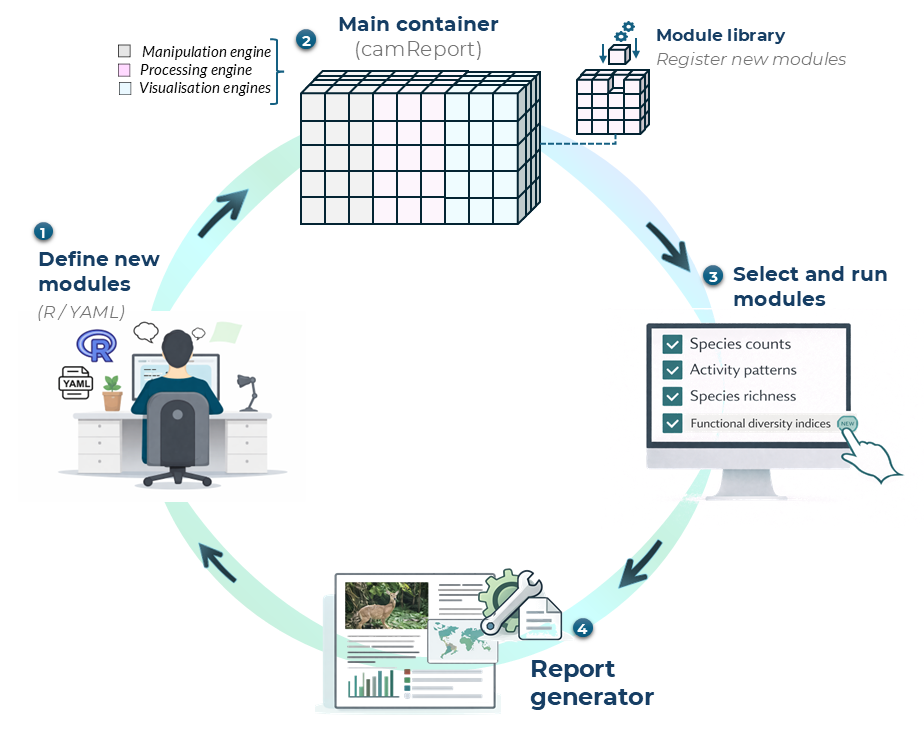

## How to add new modules?

The Ecological Report is built from separate report sections, here referred to as modules. Each module is a small report component that can contain explanatory text, R code, or both. This modular structure allows users to extend the report by adding new sections, modifying existing ones, or changing the order in which sections appear.

A new module is defined in a YAML file and then registered with `camtrapReport` using `add_Module()`. After the module has been added, it is useful to test it before generating the full report.

The modular structure of `camtrapReport` allows users to extend the Ecological Report by defining new report sections, registering them as modules, selecting which modules should be included, and then generating the final report.

```{r module-workflow, echo=FALSE, out.width="85%", fig.align="center", fig.cap="Figure 1. Modular workflow for defining, registering, selecting, and running report modules in *camtrapReport*."}

```

Figure 1 summarises how new modules are added to the report workflow. A module can be defined using R code or a YAML file, registered in the module library, added to the main `camReport` object, tested separately, and then included when generating the final Ecological Report.


### 1. List existing modules

Before adding a new module, check which modules are already available in the package.

```{r list-existing-modules, eval=FALSE}
# List all available modules
list_Modules()

# Show all section names used in the report
section_names()
```

### 2. Create a new module YAML file

A module can be written as a YAML file. The example below defines a simple module called `species_table`, which adds a species summary table to the Ecological Report.

Create a file called `species_table.yml` and save it in your working directory.

```yaml
name: species_table
title: "Species summary table"
parent: "results"
text: "This section provides a summary of the species detected in the camera-trap dataset, including their taxonomy and total number of captures."

code: |
  #| echo: false
  #| message: false
  #| warning: false
  
  species_table <- object$data_status$Species$Table
  
  if (!is.null(species_table) && nrow(species_table) > 0) {
    knitr::kable(
      species_table,
      caption = "Species detected in the camera-trap dataset."
    )
  } else {
    cat("No species table is available for this dataset.")
  }
```

The `name` field defines the internal module name. The `title` field controls the section title shown in the report. The `parent` field defines where the module belongs in the report structure, for example under `methods` or `results`. The `text` field adds explanatory text, and the `code` field contains the R code used to generate the module output.

### 3. Add the new module

After creating the YAML file, add the module using `add_Module()`. In this example, the new `species_table` module is placed before the `richness` section.

```{r add-new-module, eval=FALSE}
# Add a new module from a YAML file
add_Module(
  x = "species_table.yml",
  before = "richness",
  test = FALSE,
  object = cm
)

# Check whether the module has been added
list_Modules()
section_names()
```

You can change `before = "richness"` to another section name if you want the new module to appear elsewhere in the report.

### 4. Update the current camReport object

If the `camReport` object was already loaded before adding the module, run `setup()` again and update the report sections.

```{r update-current-object, eval=FALSE}
# Re-run setup after adding the new module
cm$setup()

# Get all available section names, including the new module
n <- section_names()

# Apply the updated section list to the camReport object
sections(cm, n)

# Check included sections
listReportSections(cm)
```

### 5. Test the new module

Before generating the full report, test only the new module. This is useful for checking whether the YAML structure, text, and R code work correctly.

```{r test-new-module, eval=FALSE}
# Test the new module only
testSection(
  cm$reportObjectElements$Modules$species_table,
  object = cm,
  view = TRUE
)
```

If the module opens correctly in the browser, it can be included in the full report.

### 6. Generate the full report

After testing, generate the full Ecological Report with the new module included.

```{r generate-report-with-new-module, eval=FALSE}
# Generate the full report
report(cm, view = TRUE)
```

This workflow allows users to extend the Ecological Report with project-specific outputs, additional summaries, new figures, or custom interpretation sections. 


